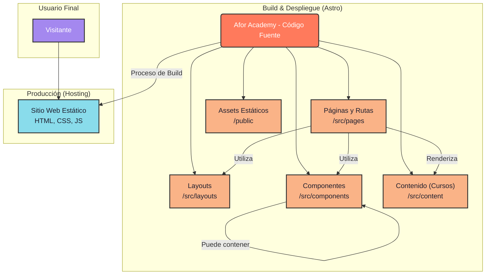

<div align="center">

# Afor-Academy - Plataforma de Aprendizaje Web Neo-Brutalista

   

**Afor-Academy** es una plataforma web con un diseño neo-brutalista, dedicada a la enseñanza de diseño y desarrollo web a otro nivel.

[Reportar Bug](https://github.com/afordigital/afor-academy/issues)

</div>

## 📸 Vista Previa

<!-- Cuando el archivo cover.jpg esté en el repositorio, esta imagen se mostrará -->


## 🚀 Acerca de Afor-Academy

Afor-Academy es una plataforma de aprendizaje enfocada en tecnologías web modernas, con una estética neo-brutalista que busca romper con los diseños tradicionales. Nuestro objetivo es ofrecer contenido de alta calidad de una manera visualmente impactante y directa.

### ✨ Características Principales

- **🎨 Diseño Neo-Brutalista**: Una interfaz única, con tipografías fuertes, colores vibrantes y sin miedo a mostrar la estructura.
- **📚 Cursos Interactivos**: Contenido educativo sobre diseño y desarrollo web (¡Próximamente!).
- **🤖 Animaciones SVG**: Uso de animaciones para una experiencia más dinámica.
- **⚡ Performance**: Construido con Astro para un rendimiento óptimo y carga rápida.

## 📊 Arquitectura del Proyecto



## 📚 Tabla de Contenidos

- [Afor-Academy - Plataforma de Aprendizaje Web Neo-Brutalista](#afor-academy---plataforma-de-aprendizaje-web-neo-brutalista)
  - [📸 Vista Previa](#-vista-previa)
  - [🚀 Acerca de Afor-Academy](#-acerca-de-afor-academy)
    - [✨ Características Principales](#-características-principales)
  - [📊 Arquitectura del Sistema (En Desarrollo)](#-arquitectura-del-sistema-en-desarrollo)
  - [📚 Tabla de Contenidos](#-tabla-de-contenidos)
  - [🚀 Comenzar](#-comenzar)
    - [📋 Prerrequisitos](#-prerrequisitos)
    - [⚡ Instalación Rápida](#-instalación-rápida)
    - [📦 Construir para Producción](#-construir-para-producción)
    - [🔍 Vista Previa de Producción](#-vista-previa-de-producción)
  - [🤝 Contribuir](#-contribuir)
  - [👥 Autores](#-autores)
  - [🛠️ Stack Tecnológico](#️-stack-tecnológico)

## 🚀 Comenzar

### 📋 Prerrequisitos

Asegúrate de tener instalado:

- **Node.js** (versión 18 o superior)
- **pnpm** (versión 10 o superior)

### ⚡ Instalación Rápida

1. **Clona o haz fork del repositorio**

   ```bash
   git clone https://github.com/afordigital/afor-academy.git
   cd afor-academy
   ```

2. **Instala las dependencias**

   ```bash
   pnpm install
   ```

3. **Ejecuta el proyecto**

   ```bash
   pnpm dev
   ```

4. **Abre tu navegador y visita**

   [http://localhost:4321](http://localhost:4321)

### 📦 Construir para Producción

Para crear una compilación lista para producción:

```bash
pnpm build
```

### 🔍 Vista Previa de Producción

Para previsualizar la compilación de producción localmente:

```bash
 pnpm preview
```

## 🤝 Contribuir

Si quieres contribuir a este proyecto, puedes hacerlo leyendo nuestra [Guía de Contribución](./CONTRIBUTING.md).

---

## 👥 Autores

<a href="https://github.com/afordigital">
   
</a>

**¡Gracias a todos los colaboradores que han hecho posible este proyecto!**

[](https://github.com/afordigital/afor-academy/graphs/contributors)

## 🛠️ Stack Tecnológico

   

### 🔧 Tecnologías Principales

- **Framework**: Astro
- **Styling**: TailwindCSS
- **Build Tool**: Vite

---

Hecho con ❤️ por [comuafor 🐀](https://discord.com/invite/comuafor)
